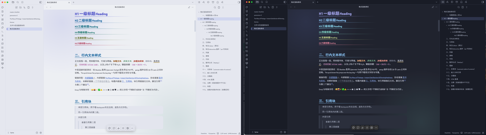

# Opal

A comprehensive, accessibility-checked theme for Obsidian, with a dual light/dark flavour and ~82 Style Settings controls. Opal descends from the Catppuccin Mocha lineage but re-tunes every hue into a muted-macaron palette with zero-duplication element roles, and covers reading view **and** Live Preview at parity.

一套「集大成」的 Obsidian 主题：浅深双 flavour、约 82 个 Style Settings 可调项、阅读态与实时预览同等覆盖，配色经过 WCAG 对比度核算。源自 Catppuccin Mocha，但把每个色相重新调成柔和马卡龙盘，元素角色零重复。

---

## Highlights / 特性

- **Dual flavour** — hand-tuned light and dark palettes, WCAG-checked (body text ≥ 4.5:1, decorative elements ≥ 3:1 in both modes).
- **~82 Style Settings controls** in 8 groups: colour, fonts, per-level headings, layout, borders & lines, element toggles, skins & motion, print. Titles and descriptions follow Obsidian's interface language automatically: Simplified Chinese for `zh`, English as the fallback. Select options use compact bilingual labels because Style Settings localises titles and descriptions only.
- **Reading + editor parity** — headings, dividers, tags, highlights, callouts, tables, task states, blockquotes and more are styled in Live Preview too, not just reading view.
- **Native feature coverage** — Bases, Canvas (6-colour mapping + accent bars + dashed group boxes), Properties, command palette, graph view, tab bar, ribbon, inline title, footnotes, status bar, tooltips.
- **Plugin adaptations** — editing-toolbar, Calendar, Admonition, Timeline, Better Export PDF, Advanced PDF Export, and more, wired through each plugin's stable classes or CSS-variable interface.
- **Callout Chinese aliases** — `[!笔记] [!警告] [!提示] [!成功] [!危险]` … map onto the semantic colours.
- **Robust by design** — every advanced feature (`color-mix`, `oklch`, `corner-shape`, `:has`) has an `@supports` fallback; honours `prefers-reduced-motion` and `prefers-reduced-transparency`; the print reset fixes the default paper surface to pure white while retaining an explicit dark-export option.

## Requirements / 依赖

- **Obsidian** 1.5.0+.
- **[Style Settings](https://github.com/mgmeyers/obsidian-style-settings)** plugin — required to reach the ~82 configuration controls. The theme renders correctly with sensible defaults even without it, but the knobs live in Style Settings.

## Fonts / 字体

Opal ships **no bundled fonts** — it uses your system fonts by default and exposes four editable font-family controls (body / heading / code / interface) in Style Settings. Screenshots may show the author's own font choices; swap them freely without affecting anything else.

Opal 不打包任何字体：默认用系统字体，并在 Style Settings 里开放正文/标题/代码/界面四个可自定义字族。示例截图可能用的是作者自己设的字体，你可随意替换，不影响其它。

## Install / 安装

Manual: copy the `Opal Theme` folder into `<vault>/.obsidian/themes/`, then **Settings → Appearance → Themes → Opal Theme**. After editing the CSS externally, switch themes away and back (or reload) so Obsidian re-reads it.

手动安装：把 `Opal Theme` 文件夹放进 `<库>/.obsidian/themes/`，然后「设置 -> 外观 -> 主题 -> Opal Theme」。外部改过 CSS 后，切主题来回一次（或重载）让 Obsidian 重新读取。

## Companion plugin (optional) / 配套插件（可选）

**Opal Companion** is a small optional plugin that adds a visual picker for the per-note things you'd otherwise type by hand: page states / accent recolour / layout via `cssclasses`, callouts, coloured highlights, task states, and image layouts. Each option renders a live preview before you pick it. The theme is fully usable without it.

**Opal Companion** 是配套小插件：把「每次用时要手打」的东西（页面态/换色/布局 `cssclasses`、callout、彩色高亮、任务态、图片版式）做成可视预览面板，看到效果再点选。主题不装它也完整可用。

## Style Settings groups / 配置分组

Colours · Fonts · Heading levels (H1-H6 size, weight, and colour) · Layout and sizing · Borders and dividers · Element toggles · Skins and motion · Print and PDF export.

配色 · 字体 · 标题分级（H1-H6 逐级字号/字重/颜色）· 布局尺寸（行宽/间距/缩进/图片）· 界面线条与边框 · 元素开关 · 皮肤与动效（Callout 皮肤、界面设计语言、复古皮肤、动效、入场）· 打印导出。

## PDF export compatibility / PDF 导出兼容

- **Obsidian PDF export and Better Export PDF:** Opal fixes the default page root, rendered document, and preview surface to `#fff`. The **Keep dark colours in exports / 导出保留暗色** setting preserves the dark export path when background printing is enabled.
- **Advanced PDF Export:** the plugin owns each preview and PDF page through its `pageBackground` setting and isolated Shadow DOM. Opal styles the surrounding modal so it follows the theme. Choose `#ffffff` in the plugin's **Page background color** control for white paper.

- **Obsidian 原生导出和 Better Export PDF：** Opal 会把默认页面根节点、正文和预览纸面固定为 `#fff`。开启「导出保留暗色」并在导出工具中启用背景打印，即可走暗色导出。
- **Advanced PDF Export：** 插件通过独立 Shadow DOM 和 `pageBackground` 设置控制预览及最终 PDF 纸面；Opal 负责适配外层窗口。需要白纸时，在插件的「Page background color」中选择 `#ffffff`。

## Credits / 致谢

Palette lineage inspired by [Catppuccin](https://github.com/catppuccin/catppuccin). Built for personal use, shared as-is.

## License

MIT © Cyrius. See [LICENSE](LICENSE).
